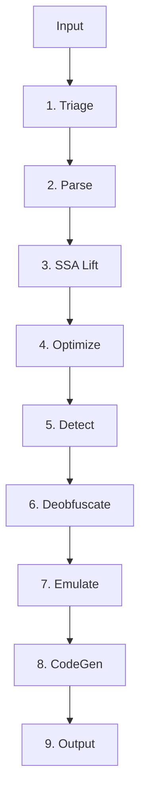

# lunadec


A production-grade Lua 5.1 decompiler and deobfuscator written entirely in Rust.

## Features
- **Target:** Standard Lua 5.1 compiled bytecode (binary chunks per PUC-Rio spec).
- **Deobfuscation:** Heuristic VM markers with ObfuscatorProfile plugin architecture capable of defeating Ironbrew 2, MoonSec, and Luraph.
- **IR & Analysis:** SSA-based Intermediate Representation construction (Cytron et al.), control-flow graph structural analysis, iterative data-flow optimization passes (Constant Folding, DCE, Copy Prop, etc).
- **Emulation:** Bounded, sandbox Lua 5.1 VM strictly to emulate string decoder functions.
- **Robust:** High-confidence obfuscator detection. Resilient against opaque predicates, control flow flattening, and anti-tamper implementations.

## Pipeline Architecture


## Dependencies
- `nom` (zero-copy combinator-based parsing)
- `clap` (derive-based argument parsing)
- `rayon` (data-parallel prototype processing)
- `indexmap` (deterministic iteration for BasicBlocks)
- `smallvec`, `bitflags` (compact collections, inline logic)
- `anyhow`, `thiserror` (structured error handling)

## Build & Install
```sh
cargo build --release
cargo clippy -- -D warnings
```

## CLI Reference
| Flag | Description |
| ---- | ----------- |
| `<INPUT>` | Positional: path to .lua or .luac file. |
| `--output / -o` | Output file path (default: stdout). |
| `--profile / -p` | Force a specific profile by name. |
| `--profile-threshold` | Minimum confidence score (default: 0.5). |
| `--verbose / -v` | Stackable: -v (info), -vv (debug), -vvv (trace). |
| `--no-color` | Disable ANSI color in log output. |
| `--dump-ir` | Dump IrModule as JSON (requires `dump` feature). |

## Usage
**End-to-End Walkthrough**
```sh
cargo run --release --bin lunadec-cli -- examples/sample_obfuscated.lua -v
```

Annotated Log Output:
```
[INFO] Starting triage...
[INFO] File identified as KIND_OBFSOURCE
[INFO] Parsed chunk (FunctionProto roots: 1)
[INFO] SSA lifted, blocks: 24
[INFO] Optimizations reached fixed point (22 passes)
[INFO] Detected profile: 'Generic' (score 0.1)
[INFO] Deobfuscation pass successful
[INFO] Emulation resolved 8 encrypted strings
[INFO] Generating Lua 5.1 source
```

**Final Deobfuscated Lua:**
```lua
local greeting = "Hello"
print(greeting .. ", Deobfuscated World!")
```

## Developer Guide
To implement a new ObfuscatorProfile plugin:
1. Implement the `ObfuscatorProfile` trait.
2. The trait provides `detect(ctx: &DetectionContext<'_>) -> f64` where you score confidence based on raw_source heuristic checks.
3. Apply transformations via `pre_decompile_pass(&mut ir_module)` and post-cleanup via `post_decompile_pass(&mut String)`.
4. Register the profile within the global `ProfileRegistry`.

## Testing Guide
Run standard library and integration tests:
```sh
cargo test
cargo bench
```
Property-based tests are included for instruction decoding/encoding with `proptest`.
